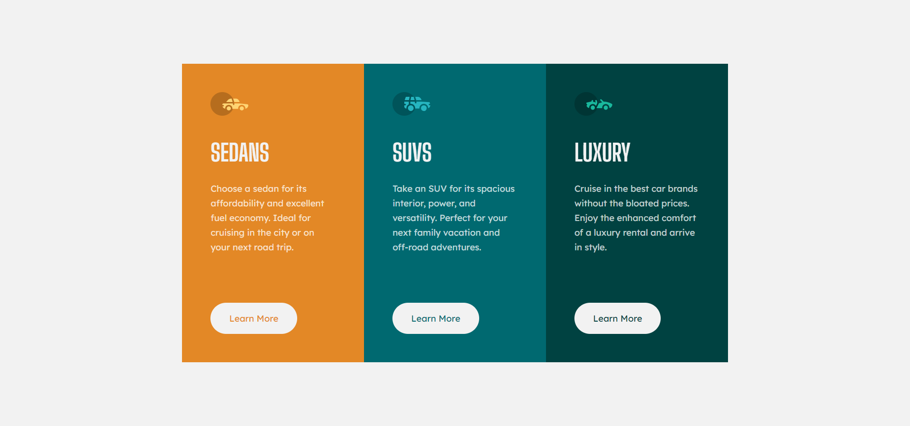

# 3 Column Preview Card Component | solution to the Frontend Mentor challenge

This is a solution to the [3-column preview card component challenge on Frontend Mentor](https://www.frontendmentor.io/challenges/3column-preview-card-component-pH92eAR2-). Frontend Mentor challenges help you improve your coding skills by building realistic projects.

## Screenshot

## Links

- Live Site URL (I use Netlify for websites hosting) ⇒

## Built with

- HTML5
- SCSS

## Author

Check out my profiles on other platforms:

- Frontend Mentor ⇒ https://www.frontendmentor.io/profile/k-malkiewicz
- Codewars ⇒ https://www.codewars.com/users/k_malkiewicz